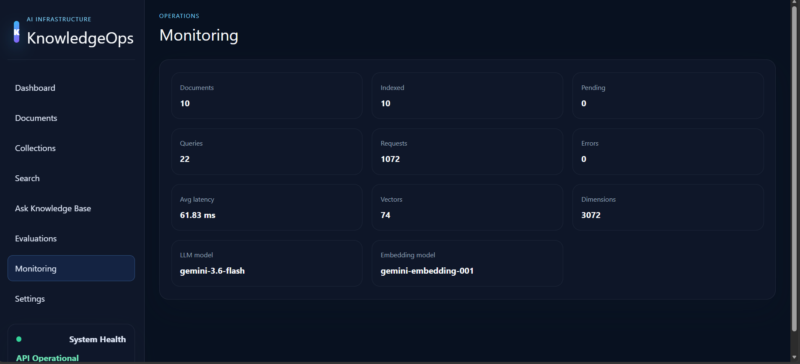
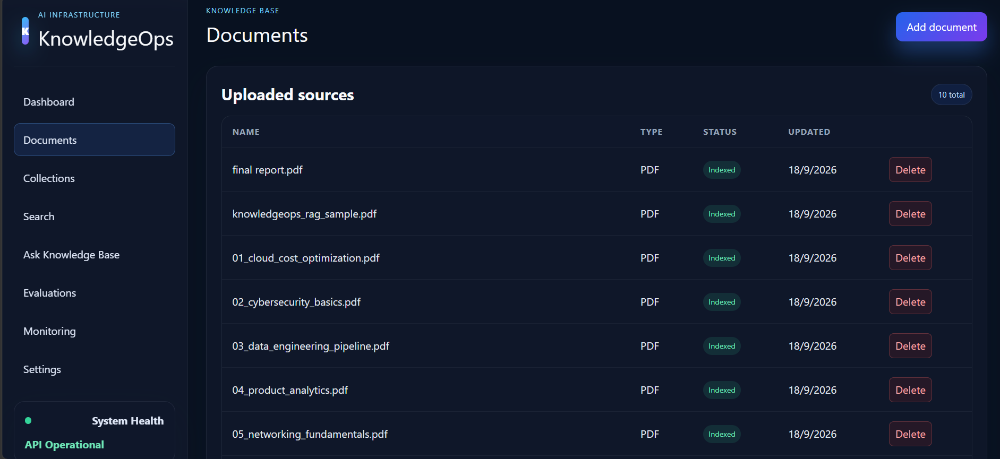
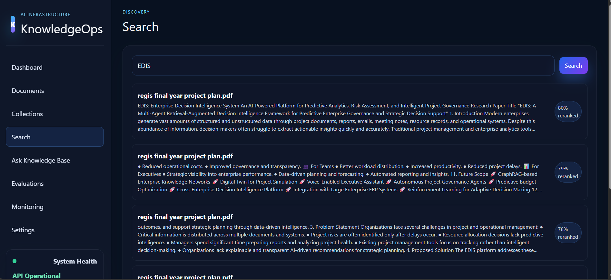
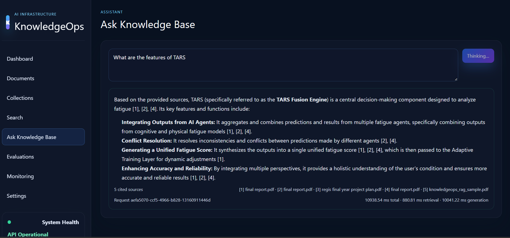

# KnowledgeOps — AI Knowledge Infrastructure & RAG Platform

> **Project 2 in AI Engineering Portfolio**  
> KnowledgeOps is an AI knowledge infrastructure platform for ingesting,
> indexing, retrieving, reranking, and evaluating technical document
> knowledge.

The system combines document processing, vector retrieval, MMR-based
reranking, grounded generation, citation validation, automated RAG
evaluation, observability, and reliability mechanisms into a single
web-based platform.
Rather than focusing only on question answering, KnowledgeOps treats RAG
as an engineering system that can be measured, inspected, and improved.

---
## 📸 Screenshots

### Dashboard


### Document Processing


### Semantic Search


### Answer with Citations


### Monitoring


## 🖼️ Platform Visual Interface & Screenshots

### 1. Quality Engineering & RAG Evaluation Suite


### 2. Document Ingestion, Processing & Indexing


### 3. Vector Search & Reranking Inspection


### 4. Grounded RAG Q&A with Citation Verification


---

## 📊 RAG Benchmark Dataset v2 Results (30 Cases across 6 Technical Domains)

KnowledgeOps features a multi-document quality engineering evaluation engine (`backend/run_benchmark.py` & `/evaluations/benchmark/run`). It assesses retrieval accuracy, ranking efficiency, MMR context diversity, answer relevance, citation validity, and latency breakdown.

### 1. Before vs. After Optimization Performance (Top-K = 5)

| Metric | Before Optimization | After Optimization | Net Change / Status |
| :--- | :---: | :---: | :---: |
| **Retrieval Hit Rate** | 100.0% | **100.0%** | Maintained on benchmark |
| **Mean Reciprocal Rank (MRR)** | 0.925 | **0.950** | **+0.025** |
| **Recall @ 5** | 100.0% | **100.0%** | Maintained on benchmark |
| **Precision @ 5** | 28.0% | **34.0%** | **+6.0 percentage points** |
| **Answer Relevance** | 41.4% | **71.1%** | **+29.7 percentage points** |
| **Groundedness** | 100.0% | **100.0%** | Maintained on benchmark |
| **Citation Correctness** | 90.0% | **100.0%** | **+10.0 percentage points** |
| **Average Total Latency** | 2.9 ms | **4.7 ms** | **+1.8 ms** |

> **Latency note:** Benchmark latency represents the measured execution path under the configured benchmark environment. It should not be interpreted as external Gemini API network latency or real-world production response latency.

---

### 2. Multi-MMR Configuration Comparison (Top-K = 5)

| Configuration | Hit Rate | MRR | Precision@5 | Recall@5 | Answer Relevance | Citation Correctness |
| :--- | :---: | :---: | :---: | :---: | :---: | :---: |
| **MMR OFF** | 100.0% | 0.950 | 34.0% | 100.0% | 71.1% | 100.0% |
| **MMR ON (λ = 0.50)** | 100.0% | 0.950 | 34.0% | 100.0% | 71.1% | 100.0% |
| **MMR ON (λ = 0.70)** | 100.0% | 0.950 | 34.0% | 100.0% | 71.1% | 100.0% |
| **MMR ON (λ = 0.90)** | 100.0% | 0.950 | 34.0% | 100.0% | 71.1% | 100.0% |

**MMR Interpretation:**  
Across the current 30-case benchmark, the tested MMR configurations produced identical aggregate metrics. This suggests that the current dataset does not contain enough retrieval-redundancy cases to clearly distinguish the different MMR settings. MMR is therefore retained as a configurable retrieval strategy rather than being presented as a benchmark-proven improvement.

---

### 3. Top-K Performance Matrix (MMR Enabled, λ = 0.70)

| Top K | Hit Rate | MRR | Recall@K | Answer Relevance | Citation Correctness | Avg Latency |
| :---: | :---: | :---: | :---: | :---: | :---: | :---: |
| **K = 3** | 100.0% | 0.950 | 95.6% | 71.1% | 100.0% | 4.5 ms |
| **K = 5** | 100.0% | 0.950 | 100.0% | 71.1% | 100.0% | 4.7 ms |
| **K = 10** | 100.0% | 0.950 | 100.0% | 71.1% | 100.0% | 4.8 ms |

---

## 🏗️ System Architecture

```text
                                USER / CLIENT
                                      │
                                      ▼
                      React 18 Dashboard (TypeScript + Vite)
                                      │
                                      ▼
                          FastAPI Backend Gateway
                                      │
              ┌───────────────────────┴───────────────────────┐
              ▼                                               ▼
     INGESTION PIPELINE                              QUERY PIPELINE
              │                                               │
     PDF File Upload & Validation                      User Question
              │                                               │
     Text Extraction (PyMuPDF)                         Query Vectorization
              │                                               │
    Deterministic Chunking                             Vector Search (Qdrant)
    & Metadata Tagging                                        │
              │                                       MMR Diversity Reranking
     Vector Embedding                                  (λ=0.70, Pool=15)
              │                                               │
              ▼                                       Structured Context Builder
       QDRANT VECTOR DB <──────────────────────────────┤
                                                              │
                                                      Answer Planner
                                                      (Aspect Decomposition)
                                                              │
                                                      LLM Generation (Gemini)
                                                              │
                                                      Citation Validator
                                                              │
                                                      Evaluator Engine
                                                      (Relevance, Groundedness, Citations)
```

## 🔍 Key Capabilities & Technical Features

- **Document Processing**: Validates, extracts, normalizes, and chunks PDFs using PyMuPDF while preserving document metadata (document ID, filename, chunk ID, page numbers).
- **Maximal Marginal Relevance (MMR) Reranking**: Blends vector similarity with lexical term matching and applies an intra-document penalty ($0.40$) to prevent single-document clutter.
- **Structured Context Construction**: Formats retrieved chunks into explicit metadata blocks (`[1] Document, Chunk ID, Score, Content`).
- **Aspect-Based Answer Relevance Evaluator**: Decomposes user questions into target sub-topics and verifies complete coverage without hallucination.
- **Grounded LLM Generation & Citation Verification**: Enforces inline citations `[1]`, `[2]`, validates citations against retrieved documents, and returns a structured insufficient-evidence fallback when evidence is missing.
- **Failure Classification & Case Inspection**: Classifies benchmark cases into failure categories (`Retrieval`, `Context`, `Generation`, `Citation`, `Evaluation`, `None`) with an interactive UI drawer.
- **Latency Monitoring**: Measures embedding, vector retrieval, MMR reranking, LLM generation, and total latency breakdown.
- **Reliability & Resilience**: Circuit breaking, exponential backoff retries for LLM API calls, rate limit handling, and health check endpoints (`/health`, `/health/services`).

## 💻 Tech Stack

- **Frontend**: React 18, TypeScript, Vite, Vanilla CSS (Dark Space Aesthetic)
- **Backend**: Python 3.12, FastAPI, Pydantic, PyMuPDF, SQLite
- **Vector Database**: Qdrant Vector Search Engine
- **LLM & Embeddings**: Gemini Embedding (`gemini-embedding-001`), Gemini Flash (`gemini-2.5-flash`)
- **Testing & Quality Assurance**: Pytest (38 automated tests), GitHub Actions CI/CD, Docker Compose

## 🚀 Quick Start Guide

### Prerequisites

- Docker & Docker Compose **OR** Python 3.10+ & Node.js 20+

### Option 1: Docker Compose (Recommended)

1. Clone repository & prepare environment config:

   ```bash
   git clone https://github.com/your-username/KnowledgeOps.git
   cd KnowledgeOps
   cp .env.example .env
   ```

2. Start all services:

   ```bash
   docker compose up --build
   ```

3. Access platform endpoints:
   - **Frontend Dashboard**: http://localhost:5173
   - **FastAPI OpenAPI Docs**: http://localhost:8000/docs
   - **Qdrant Vector Dashboard**: http://localhost:6333/dashboard

---

### Option 2: Local Development Setup

#### 1. Backend Setup
```bash
cd backend
python -m venv .venv
source .venv/bin/activate  # Windows: .venv\Scripts\activate
pip install -r requirements.txt
uvicorn app.main:app --reload --host 0.0.0.0 --port 8000
```

#### 2. Frontend Setup
```bash
cd frontend
npm install
npm run dev -- --host 0.0.0.0
```

---

## 🧪 Testing & Quality Engineering

### Run Pytest Test Suite
```bash
cd backend
python -m pytest tests -v
```
*Current test status: **38/38 passed** across chunking, reranking, vector search, answer relevance, citation verification, reliability, and RAG pipeline scenarios.*

### Run Benchmark Suite (30 Cases)
```bash
cd backend
python run_benchmark.py
```

### Validate Frontend Production Build
```bash
cd frontend
npm run build
```

---

## 📌 Known Limitations & Future Roadmap

1. **Synthetic Fallback Mode**: When `LLM_API_KEY` is not provided, the benchmark engine uses a deterministic fallback generator. For full generative reasoning, set a valid `LLM_API_KEY`.
2. **Dense Hybrid Search**: Hybrid search currently uses combined vector similarity + BM25 keyword matching. Future iterations will introduce native Sparse-Dense vector indexing.
3. **Multi-Modal PDF Extraction**: Current PDF parsing focuses on text content. Future roadmap includes OCR and table extraction via Unstructured/LayoutLM.

---

## 🛡️ License

MIT License — free for modification and enterprise reference architecture reuse.
